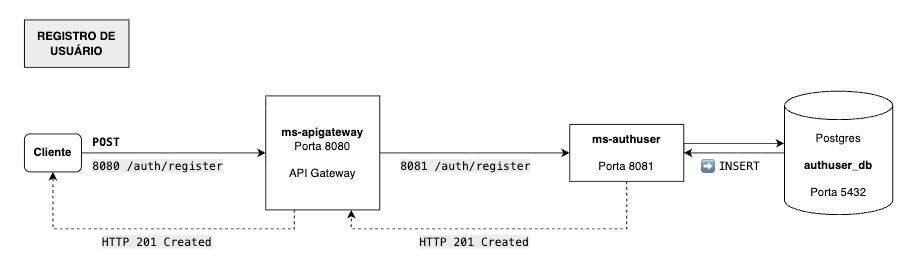
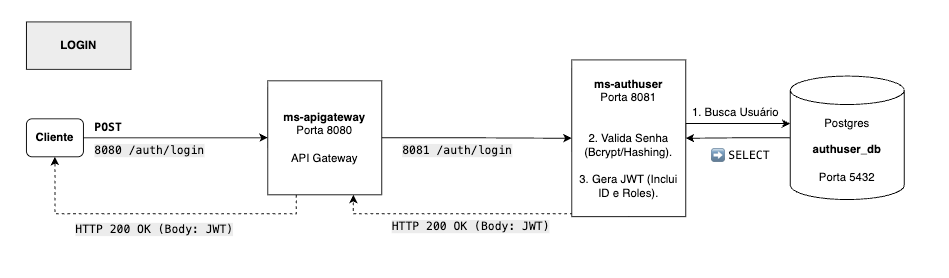
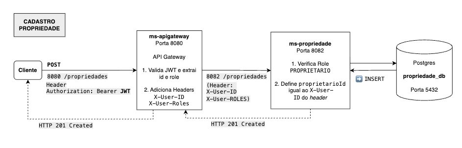
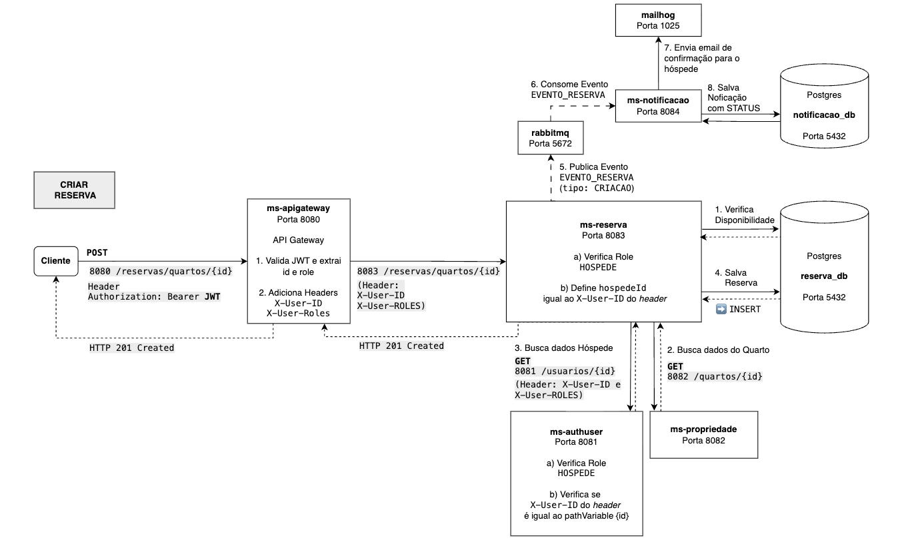

# 📖 Plataforma de Reservas em Microsserviços

## 🎯 Objetivo

O projeto visa refatorar uma aplicação para uma arquitetura de microsserviços madura, demonstrando excelência em **Arquitetura Hexagonal (Ports & Adapters) e Arquitetura de Camadas (Service / Repository / Controller..)**, **Segurança Centralizada (JWT)** e **Resiliência (Circuit Breaker)**.

---

## 1. Visão Geral e Arquitetura

### 1.1 Arquitetura Adotada por Microsserviço

O projeto combina a flexibilidade da Arquitetura em Camadas com o alto desacoplamento da Arquitetura Hexagonal (Ports & Adapters).

| Serviço | Domínio / Responsabilidade | Padrão Arquitetural | Justificativa |
| :--- | :--- | :--- | :--- |
| **API Gateway** | Roteamento, Validação JWT, Autorização Grossa. | Spring Cloud Gateway (WebFlux) | Ponto de entrada e motor de segurança reativo. |
| **Auth-User MS** | Identidade, Login, Criptografia (Bcrypt). | **Camadas Tradicionais** | Domínio de dados simples (CRUD). |
| **Propriedade MS** | CRUD de Propriedades e Quartos. | **Camadas Tradicionais** | Domínio de dados simples (CRUD). |
| **Reservas MS** | Orquestração, Resiliência, Validação de Disponibilidade, Agendamento. | **Hexagonal (Ports & Adapters)** | Exige desacoplamento de infraestrutura (WebClient, RabbitMQ, JPA). |
| **Notificacao MS** | Consumo de Eventos, Envio de E-mail, Log de Persistência. | **Hexagonal (Ports & Adapters)** | Isolamento de infraestrutura de mensageria (RabbitMQ) e e-mail (MailHog). |

### 1.2 Estrutura (Hexagonal)

* **Ports (Contratos):** Interfaces como `ReservaPortIn` (entrada) e `NotificacaoSender` (saída) que definem o que o Core faz.
* **Adapters (Infraestrutura):** Classes que implementam as Ports, lidando com o *mundo externo* (`ReservaController` para Web, `NotificacaoSenderImpl` para MailHog).

---

## 2. Segurança e Comunicação Service-to-Service

O modelo de segurança é *stateless* e confiável.

### 2.1 Fluxo de Autenticação e Propagação JWT

1.  **Geração:** Auth-User MS gera o JWT.
2.  **Validação:** O **API Gateway** valida o JWT e **remove** o header `Authorization`.
3.  **Propagação (Service-to-Service Auth):** O Gateway insere *headers* de segurança confiáveis (trusting headers) para uso nos microsserviços de domínio:

| Header | Uso |
| :--- | :--- |
| **`X-User-ID`** | ID do usuário. Usado no Service para checar o pertencimento (`reserva.hospedeId == userId`). |
| **`X-User-Roles`** | Perfil único (`HOSPEDE`, `PROPRIETARIO`, `ADMIN`). Usado pelo `@PreAuthorize` do Spring Security. |

### 2.2 Resiliência (ms-reservas)

O **Reservas MS** utiliza **WebClient** e **Resilience4j** para proteger as chamadas síncronas de orquestração:

* **Circuit Breaker:** Evita falhas em cascata, abrindo o circuito se o serviço dependente falhar (`@CircuitBreaker`).
* **Timeout / Retry / Bulkhead:** Gerenciam a latência e a capacidade de *thread* para evitar sobrecarga.

### 2.3 Comunicação Assíncrona (RabbitMQ)

O `ms-reservas` publica o evento **`EVENTO_RESERVA`** (payload rico em dados) no RabbitMQ.

* **Objetivo:** O **ms-notificacao** consome o evento sem precisar fazer chamadas síncronas de volta para o sistema (isolamento completo).

---

## 3. Detalhamento dos Microsserviços e Rotas Chave

| Serviço | Rotas Chave (Externa) | Regra de Autorização Grossa (Gateway) |
| :--- | :--- | :--- |
| **Auth-User MS** | `/auth/login`, `/auth/register` | **PÚBLICO** |
| **Propriedade MS** | `POST /propriedades/` | **PROPRIETARIO** ou **ADMIN** |
| **Reservas MS** | `POST /reservas/quarto/{id}` | **HOSPEDE** |
| **Reservas MS** | `GET /reservas/propriedade/{id}` | **PROPRIETARIO** ou **ADMIN** |

---

## 4. Infraestrutura e DevOps

### 4.1 Docker Compose e Isolamento

* **Rede:** Todos os MS, o RabbitMQ e o Postgres residem na rede privada (`hotel_network`). A comunicação é feita via **nome do serviço** (`http://ms-authuser:8081`).
* **Exposição:** Apenas o **API Gateway** expõe a porta `8080`.
* **DB Isolados:** Utilizamos um único container **Postgres** com quatro bases de dados lógicas e isoladas (`authuser_db`, `reservas_db`, etc.) — o padrão *Database per Service*.

### 4.2 MailHog e Teste de E-mail

O **MailHog** (acessível em `http://localhost:8025`) atua como o servidor SMTP de desenvolvimento. Ele intercepta todos os e-mails enviados pelo **ms-notificacao** para facilitar a verificação e depuração.

### 4.3 GitHub Actions (CI)

Um *workflow* de CI está configurado para o `main` e exige que o *build* (`mvn clean verify`) passe e que haja **aprovação manual** dos desenvolvedores (Vinicius, Juliana, Nicholle e Francisco) antes de qualquer *merge*.

## 5. Fluxos de Trabalho (Diagramas)

---
### Fluxo de Cadastro

* **Foco:** Criação do Usuário e Criptografia de senha.

****

---
### Fluxo de Login (Geração de JWT)

* **Foco:** Validação do Bcrypt, Geração do JWT e Retorno do Token ao Cliente.

****

---
### Fluxo de Criação de Propriedade

* **Foco:** Autorização Grossa (Gateway) e Autorização Fina (Pertencimento) no MS-Propriedade.

****

---
### Fluxo de Criação de Reserva + Fluxo de Notificação 

* **Foco:** Orquestração Síncrona, Resiliência (CB), e Publicação Assíncrona (Evento Rico) no RabbitMQ.

****
